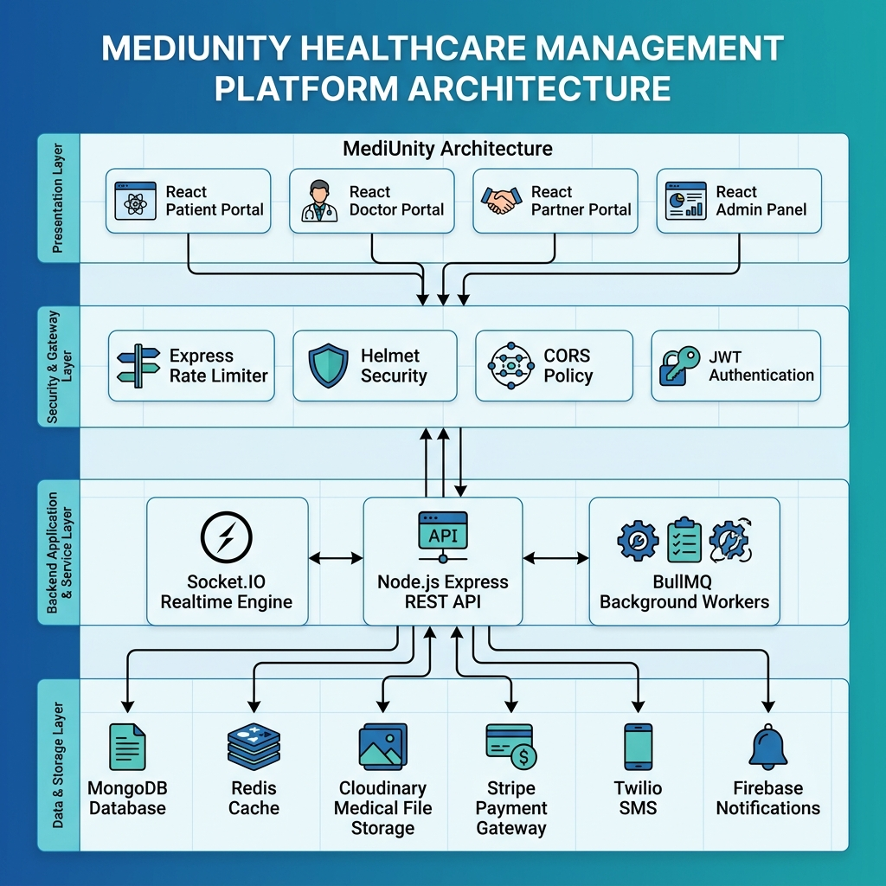
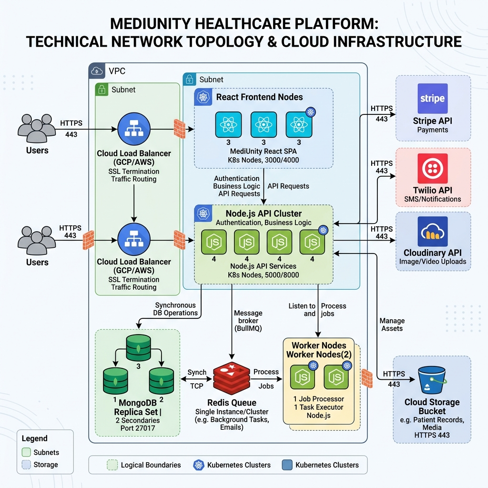
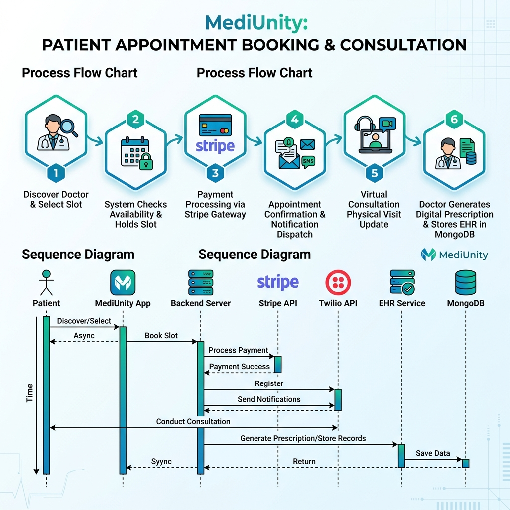
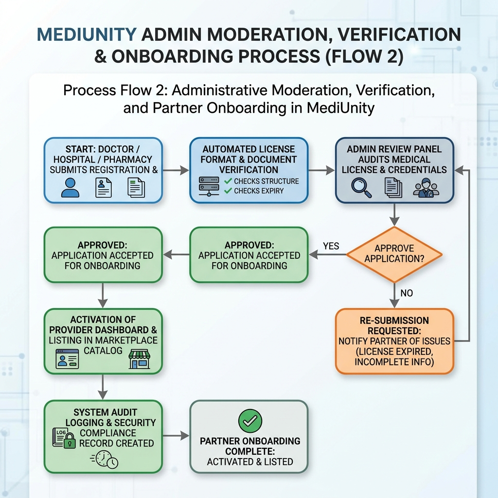
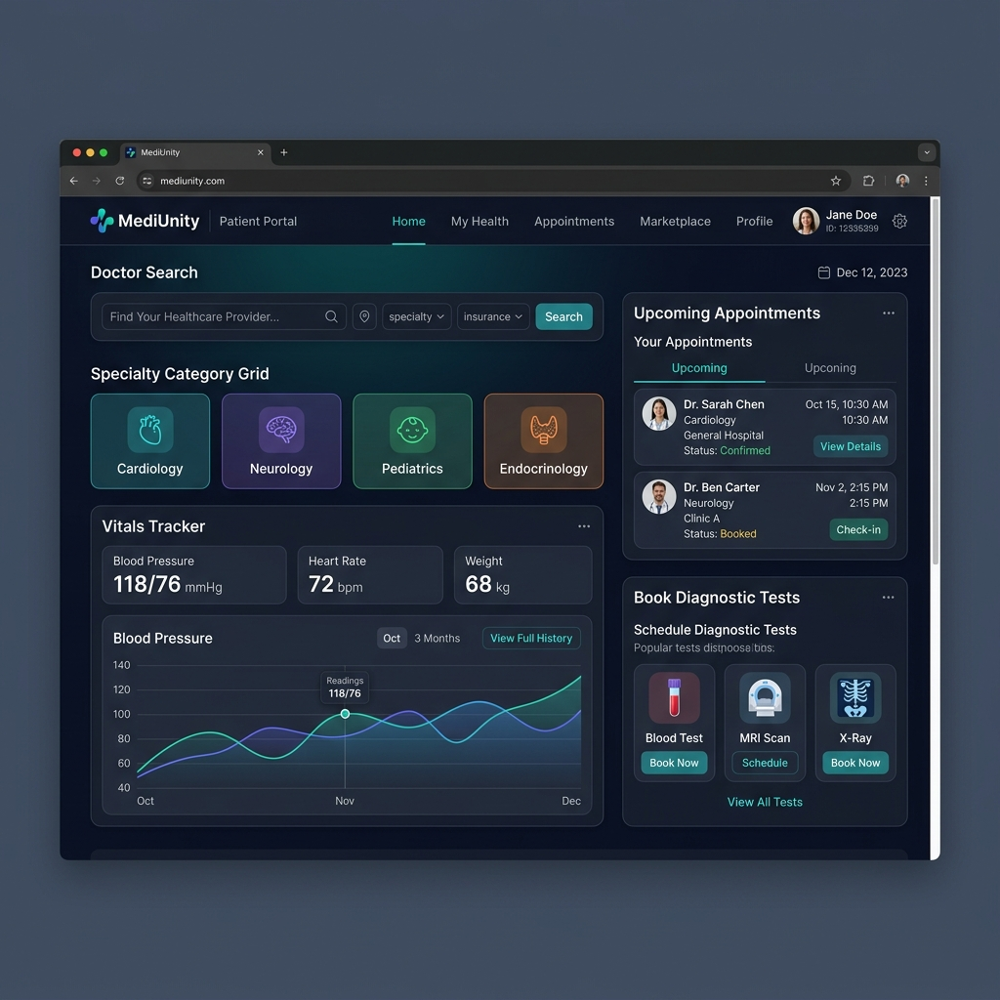
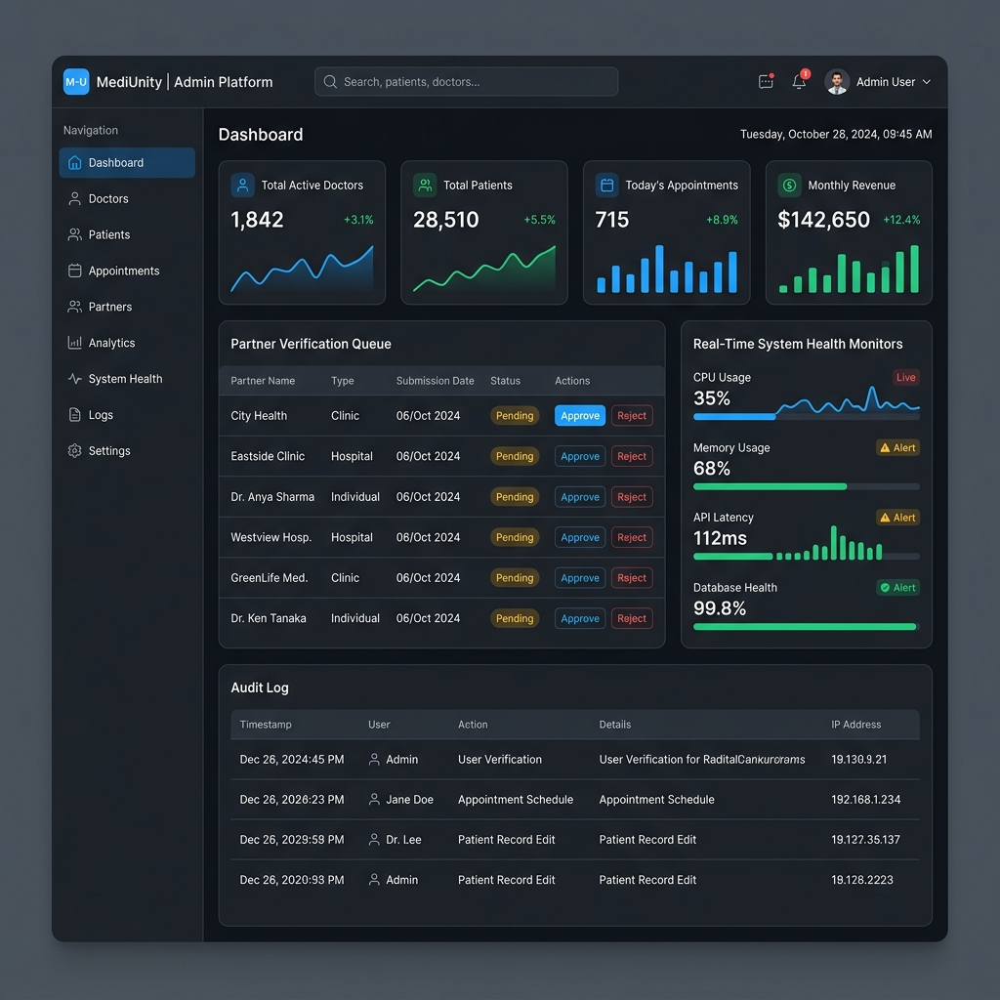

# MediUnity: A Cloud-Ready Distributed Multi-Portal Healthcare and Wellness Platform

**By**  
**Sarower Rahman** (ID: 111222033)  
**Joy Ranjanshil** (ID: 111222007)  
*10th Batch (Fall 2022 – Spring 2026)*

**Supervised by**  
**Sabbir Ahmed Shihab**  
*Lecturer*  
*Department of Computer Science and Engineering (CSE)*  
*CCN University of Science and Technology, Kothbari, Cumilla, 3500*  

**Date:** Spring 2026 (May 2026)

---

## Board of Examiners

The project report titled **"MediUnity: A Cloud-Ready Distributed Multi-Portal Healthcare and Wellness Platform"**, submitted by **Sarower Rahman** (ID: 111222033) and **Joy Ranjanshil** (ID: 111222007) of the 10th Batch (Fall 2022 – Spring 2026), has been examined and accepted as satisfactory in partial fulfillment of the requirements for the degree of Bachelor of Science in Computer Science and Engineering (CSE).

| Examiner Details & Signature | Board Role |
| :--- | :--- |
| **Sabbir Ahmed Shihab** Supervisor & Lecturer, Department of CSE CCN University of Science and Technology | Chairman (Internal) |
| **Head of Department** Department of Computer Science and Engineering (CSE) CCN University of Science and Technology | Member (Ex-Officio) |
| **Internal Examiner** Department of Computer Science and Engineering (CSE) CCN University of Science and Technology | Member (Internal) |
| **External Examiner** Department of Computer Science and Engineering (CSE) Partner University / Industry Expert | Member (External) |

---

## Declaration of Originality

We hereby declare that the work presented in this project report entitled **"MediUnity: A Cloud-Ready Distributed Multi-Portal Healthcare and Wellness Platform"** is an authentic record of our own research and development work carried out under the supervision of **Sabbir Ahmed Shihab**, Lecturer, Department of Computer Science and Engineering (CSE), CCN University of Science and Technology, Cumilla.

We confirm that:
- The material contained in this report has not been submitted previously, in full or in part, for any degree, diploma, or qualification at this or any other university or institute.
- All core algorithms, system architectures, database schemas, API routes, and frontend portals described herein were designed and implemented by the undersigned project team.
- Wherever third-party open-source libraries, external APIs, software frameworks, or literature references have been utilized, they have been fully acknowledged and cited in accordance with standard academic ethics and IEEE reference formats.

**Signatures of Candidates:**

_____________________________  
**Sarower Rahman**  
ID: 111222033  
10th Batch, Department of CSE, CCN UST  

_____________________________  
**Joy Ranjanshil**  
ID: 111222007  
10th Batch, Department of CSE, CCN UST  

---

## Acknowledgements

First and foremost, we express our deepest gratitude to Almighty God for providing us with the health, strength, wisdom, and perseverance needed to successfully complete our undergraduate project and synthesize this comprehensive technical report.

We wish to extend our most sincere gratitude and profound appreciation to our esteemed project supervisor, **Sabbir Ahmed Shihab**, Lecturer, Department of Computer Science and Engineering (CSE), CCN University of Science and Technology. His invaluable guidance, constructive feedback, insightful critique, and continuous technical encouragement throughout the design and execution phases were fundamental to the realization of MediUnity.

We are also deeply thankful to the honorable Head of the Department of Computer Science and Engineering and all respected faculty members of CCN UST for providing a rigorous academic foundation, modern laboratory facilities, and an inspiring environment that fostered our technical growth.

Finally, we express our heartfelt appreciation to our families and fellow classmates of the CSE 10th Batch for their constant moral support, patience, and motivation during long hours of software development, testing, and documentation.

---

## Abstract

Modern healthcare delivery across global environments faces persistent challenges, including fragmented patient communication, manual appointment scheduling bottlenecks, delayed access to patient medical histories, isolated pharmacy inventories, and a lack of unified digital coordination between healthcare providers. To resolve these systemic inefficiencies, this project presents **MediUnity**—a cloud-ready, full-stack, multi-portal healthcare and wellness management platform engineered for global accessibility.

MediUnity unifies five critical healthcare stakeholders into a cohesive digital ecosystem: patients, medical doctors, hospitals, diagnostic centers, and licensed pharmacies, backed by an enterprise administrative control center. The platform architecture utilizes a modern JavaScript stack comprising React 19 and Vite for responsive presentation, Node.js with Express.js for RESTful API orchestration, MongoDB via Mongoose ODM for schemaless electronic health record storage, and Redis coupled with BullMQ for asynchronous background process queues. Real-time interaction—including instant doctor-patient messaging, emergency notification dispatches, and appointment queue updates—is driven by Socket.IO, while external cloud integrations facilitate secure media storage (Cloudinary), payment processing (Stripe), multi-channel alerts (Nodemailer, Twilio, Firebase Admin), and optical character recognition for prescriptions (Tesseract.js).

Key technical achievements of MediUnity include role-based multi-portal access control (RBAC), end-to-end appointment lifecycle tracking, integrated diagnostic test ordering, automated medicine delivery workflows, interactive patient vitals logging, automated doctor payout calculations, and multi-layered security middleware enforcing rate limiting, input sanitization, CORS protection, and HTTP header security via Helmet. Extensive testing and validation demonstrate high operational throughput, low latency, robust data protection, and seamless multi-device responsiveness. MediUnity serves as a scalable, production-ready foundation capable of expanding digital healthcare access worldwide.

---

## Table of Contents

- **Board of Examiners** .......................................................................................................... ii
- **Declaration of Originality** .................................................................................................. iii
- **Acknowledgements** .......................................................................................................... iv
- **Abstract** ........................................................................................................................... v
- **List of Figures** .................................................................................................................. vii
- **Chapter 1: Introduction** ..................................................................................................... 1
  - 1.1 Introduction .............................................................................................................. 1
  - 1.2 Purpose of the Project ............................................................................................... 2
  - 1.3 Scope ....................................................................................................................... 3
  - 1.4 Project Outline ......................................................................................................... 4
- **Chapter 2: Literature Review** ............................................................................................ 5
  - 2.1 Characteristics ......................................................................................................... 5
  - 2.2 Used Technology ...................................................................................................... 7
  - 2.3 Software Requirement .............................................................................................. 9
    - 2.3.1 Hardware Requirement ...................................................................................... 10
- **Chapter 3: Methodology and Design** ................................................................................ 11
  - 3.1 System Architecture ................................................................................................. 11
  - 3.2 Simulated Diagram ................................................................................................... 13
    - 3.2.1 Process Flow 1: Patient Booking & Consultation Flow .............................................. 14
    - 3.2.2 Process Flow 2: Admin Moderation & Partner Verification ........................................ 16
- **Chapter 4: Results and Implementation** ............................................................................ 18
  - 4.1 User Part .................................................................................................................. 18
  - 4.2 Admin Part ............................................................................................................... 21
- **Chapter 5: Conclusion and Future Directions** .................................................................... 24
  - 5.1 Advantages .............................................................................................................. 24
  - 5.2 Limitations ............................................................................................................... 25
  - 5.3 Future Scopes ........................................................................................................... 26
- **References** ...................................................................................................................... 27

---

## List of Figures

- **Figure 3.1:** MediUnity High-Level System Architecture Diagram .............................................. 12
- **Figure 3.2:** Simulated Cloud Network Topology and Service Infrastructure ............................. 13
- **Figure 3.3:** Patient Appointment Booking & Telehealth Consultation Workflow .................... 15
- **Figure 3.4:** Administrator Moderation and Partner Onboarding Verification Workflow ............. 17
- **Figure 4.1:** Patient & End-User Interactive Application Dashboards .......................................... 19
- **Figure 4.2:** Administrator Control Center & System Compliance Monitoring Interface ............. 22

---

## Chapter 1: Introduction

### 1.1 Introduction
Healthcare delivery in the modern era is undergoing a fundamental digital transformation driven by the rapid evolution of distributed web technologies, real-time messaging, mobile accessibility, and cloud computing. Traditional medical service management—characterized by paper-based recordkeeping, physical queue management, fragmented diagnostic laboratory reporting, manual pharmacy inventory checks, and isolated doctor consultations—is increasingly inadequate to meet global healthcare demands. Patients face severe delays in securing qualified medical consultations, accessing personal health records, and purchasing specialized pharmaceuticals. Concurrently, medical practitioners and health facility administrators suffer from operational inefficiencies, disconnected patient data silos, and administrative burdens.

To address these critical global healthcare challenges, this project introduces **MediUnity** (alternatively designated as the Medicare System)—an enterprise-grade, cloud-ready, multi-portal digital healthcare and wellness ecosystem. Built with a scalable multi-tenant architecture, MediUnity connects patients, medical clinicians, hospitals, diagnostic centers, and retail pharmacies into a single, unified digital platform. Designed for global operational deployment, MediUnity provides localized and worldwide reach, multilingual capabilities, internationalized health metric tracking, and compliant medical record management.

### 1.2 Purpose of the Project
The primary objective of MediUnity is to engineer a unified digital healthcare ecosystem that eliminates geographical and structural barriers between healthcare consumers and medical providers. The specific core purposes of the system include:

1. **Universal Healthcare Marketplace:** Constructing an intuitive marketplace where users globally can search, evaluate, and connect with verified medical doctors, accredited hospitals, diagnostic laboratories, and licensed retail pharmacies.
2. **Streamlined Appointment Scheduling:** Providing real-time doctor availability calendars, automated consultation booking, instant payment processing, and multi-channel appointment reminders.
3. **Centralized Electronic Health Records (EHR):** Establishing a secure, cloud-hosted repository for patient medical histories, lab test diagnostic reports, prescription histories, and vital health logs accessible across multi-portal interfaces.
4. **Integrated Pharmacy & Diagnostic Services:** Enabling patients to book lab specimen collections, order diagnostic imaging, and purchase prescribed medications for home delivery directly through the platform.
5. **Operational Administrative Supervision:** Equipping platform administrators with robust oversight tools for partner verification, medical license auditing, compliance monitoring, revenue allocation, and system telemetry.

### 1.3 Scope
The functional and technical scope of MediUnity spans multiple operational boundaries and software domains:

- **Global Applicability & Multitenancy:** Designed for global scalability across urban and regional healthcare systems without localized hardcoding, supporting international date formats, currency units, and multi-region cloud deployment.
- **Multi-Portal User Interfaces:** Includes dedicated client portals optimized for distinct stakeholders: Patient Web Portal (`frontend` & `frontend-patient`), Doctor Portal (`frontend-doctor`), Partner Provider Portal (`frontend-partner`), and Administrative Control Panel (`admin`).
- **Asynchronous & Real-Time Communications:** Features Socket.IO web socket channels for real-time teleconsultation chat, live doctor status updates, and automated background push notifications via Redis and BullMQ queues.
- **Financial & Service Integrations:** Integrates Stripe payment gateways for instant consultation fee processing, automated doctor payout accounting, and Cloudinary media pipelines for high-resolution medical document storage.
- **Boundary Constraints:** While MediUnity facilitates virtual consultations, medical file sharing, and e-prescriptions, it acts as a digital facilitator and does not replace emergency ICU life-support hardware or physical surgical apparatus.

### 1.4 Project Outline
The remainder of this project report is structured into the following detailed chapters:

- **Chapter 2: Literature Review –** Examines existing healthcare management systems, analyzes comparative platform features, details the technological stack (React 19, Express, MongoDB, Redis, Cloudinary), and outlines software/hardware requirements.
- **Chapter 3: Methodology and Design –** Explains the multi-tier system architecture, cloud deployment topology, entity-relationship schemas, and process flow diagrams for appointment booking and administrative moderation.
- **Chapter 4: Results and Implementation –** Demonstrates the practical implementation outcomes from both the end-user perspective (patient/doctor workflows) and administrative operational control panel.
- **Chapter 5: Conclusion and Future Directions –** Summarizes platform achievements, highlights architectural advantages, identifies system limitations, and outlines future enhancements including AI symptom triage and wearable IoT integration.

---

## Chapter 2: Literature Review

Digital health platforms have evolved significantly over the past two decades, transitioning from localized desktop electronic medical record (EMR) databases to cloud-native telemedicine marketplaces. This chapter reviews existing healthcare systems, outlines the key characteristics of MediUnity, details the primary technology stack, and lists the required software and hardware specifications.

### 2.1 Characteristics
MediUnity distinguishes itself from existing proprietary and legacy health management platforms through several core architectural characteristics:

1. **Multi-Portal Domain Separation:** Unlike monolithic healthcare tools that force all user roles into a single crowded interface, MediUnity deploys specialized frontend portals (`frontend-patient`, `frontend-doctor`, `frontend-partner`, `admin`) styled specifically for role-tailored user experience.
2. **Cloud-Native Scalability:** Architected with stateless Express REST APIs, decoupled MongoDB database clusters, and container-ready configuration (`render.yaml`, environment templates), enabling horizontal autoscaling during peak demand.
3. **Asynchronous Task Processing:** Leverages Redis and BullMQ queue workers to handle compute-heavy and latent jobs (SMS dispatches via Twilio, email newsletters via Nodemailer, optical character recognition via Tesseract.js) without blocking HTTP response loops.
4. **Comprehensive Service Lifecycle:** Facilitates end-to-end medical care, encompassing initial doctor search, slot reservation, online payment, virtual consultation, prescription generation, diagnostic lab testing, pharmacy order fulfillment, and specialist referral transfers.
5. **Defense-in-Depth Security:** Incorporates multi-layered security middleware including Helmet HTTP header protection, IP-based rate limiting, MongoDB query sanitization, XSS payload filtering, and JWT token authentication.

### 2.2 Used Technology
The technical stack powering MediUnity was selected for high performance, developer agility, robust community support, and enterprise cloud compatibility:

| Layer / Domain | Technology Stack | Role & Implementation Purpose |
| :--- | :--- | :--- |
| **Frontend Client** | React 19, Vite, Tailwind CSS, Lucide Icons, Axios | Responsive single-page applications for Patients, Doctors, Partners, and Admins with PWA capability. |
| **Backend Server** | Node.js, Express.js (v5), Socket.IO | RESTful API web server, real-time WebSocket messaging, and request routing. |
| **Database & Caching** | MongoDB, Mongoose ODM, Redis | Schemaless document store for EHR/users; Redis for queue management and session caching. |
| **Async & Processing** | BullMQ, Tesseract.js, Nodemailer, Twilio | Background queue workers, OCR prescription parsing, automated email dispatches, and SMS dispatches. |
| **Cloud & Security** | Cloudinary, Stripe, Helmet, Express-Rate-Limit | Cloud medical file storage, global payment processing, rate limiting, and HTTP security headers. |

### 2.3 Software Requirement
The software tools and operational environment required to build, execute, and host MediUnity comprise:

- **Operating System:** Cross-platform compatibility across Microsoft Windows 10/11, Ubuntu Linux 22.04 LTS, or macOS Sonoma.
- **Node.js Runtime:** Node.js v18.x or v20.x LTS with npm v9.x+ package manager.
- **Database Engine:** MongoDB v6.0+ Community Server or MongoDB Atlas Cloud instance.
- **In-Memory Store:** Redis v7.0+ for BullMQ background job queuing.
- **Web Browsers:** Modern evergreen browsers supporting HTML5, WebSockets, and ES6+ (Google Chrome, Mozilla Firefox, Microsoft Edge, Apple Safari).
- **Development Tools:** Visual Studio Code / Antigravity IDE, Git version control, Postman API tester.

#### 2.3.1 Hardware Requirement
The minimum and recommended hardware specifications for hosting and running MediUnity across development and cloud environments are outlined below:

| Component | Minimum Requirement (Dev/Test) | Recommended (Cloud Production) |
| :--- | :--- | :--- |
| **Processor (CPU)** | Dual-Core 2.0 GHz Intel/AMD or Apple M1 | 8-Core 3.0 GHz x86-64 / ARM Cloud Server Instance |
| **System Memory (RAM)** | 4 GB DDR4 RAM | 16 GB to 32 GB High-Speed RAM |
| **Storage (Disk)** | 10 GB available SSD space | 100 GB NVMe SSD with automated cloud backups |
| **Network Bandwidth** | 10 Mbps broadband internet connection | 1 Gbps dedicated cloud network interface with DDoS mitigation |

---

## Chapter 3: Methodology and Design

This chapter details the system engineering methodology, architectural layout, network deployment topology, and core process flow diagrams that govern MediUnity's operations.

### 3.1 System Architecture
MediUnity follows a decoupled multi-tier architecture structured across four distinct operational layers: Presentation, Security Gateway, Application Services, and Data/Storage Layer. Figure 3.1 illustrates this layered structure.

- **Presentation Layer:** Comprises lightweight React 19 single-page applications served via Vite. Dedicated portals exist for Patients, Doctors, Partner Organizations (Hospitals, Pharmacies, Diagnostic Centers), and System Administrators.
- **Security & Gateway Layer:** All incoming client HTTP/WebSocket requests pass through express-rate-limit to prevent brute-force attacks, Helmet to enforce HTTP security headers, mongo-sanitize to neutralize NoSQL injections, and CORS policy controllers.
- **Application & Service Layer:** Powered by Express.js REST API routers, managing business logic for appointments, user profiles, diagnostic bookings, orders, and payment transactions. Socket.IO manages real-time messaging, while BullMQ workers process background tasks.
- **Data & External Integration Layer:** MongoDB handles persistent document storage (Mongoose models for Patients, Doctors, Appointments, Orders, Prescriptions, Audit Logs). Redis stores transient queue states. External APIs handle Cloudinary media, Stripe payments, Twilio SMS dispatches, and Firebase notifications.

  
*Figure 3.1: MediUnity High-Level System Architecture Diagram showing multi-portal client layers, security gateway middleware, Node.js API engine, and MongoDB/Redis data tiers.*

### 3.2 Simulated Diagram
To demonstrate production readiness, MediUnity's infrastructure was modeled as a distributed cloud container deployment. Figure 3.2 depicts the simulated network topology.

The network architecture utilizes a cloud load balancer with SSL/TLS termination to route HTTPS traffic across an auto-scaling cluster of React frontend static nodes and Node.js API application containers. Background processing is offloaded to containerized BullMQ worker instances communicating with a high-availability Redis instance. MongoDB is deployed in a replica set configuration to ensure continuous data availability and disaster recovery.

  
*Figure 3.2: Simulated Cloud Network Topology and Infrastructure Diagram featuring Load Balancers, API Clusters, BullMQ Worker Containers, Redis Caches, and MongoDB Replica Sets.*

#### 3.2.1 Process Flow 1: Patient Booking & Consultation Flow
Process Flow 1 (Figure 3.3) illustrates the end-to-end sequence executed when a patient searches for a doctor, schedules an appointment, processes payment, and conducts a consultation:

1. **Doctor Search & Discovery:** Patient queries the marketplace by medical specialty, location, or rating. Frontend requests filtered results from `/api/doctors`.
2. **Slot Selection & Lock:** Patient selects an available time slot. The system verifies slot availability in `Appointment` collection and places a temporary hold.
3. **Stripe Payment Processing:** Patient submits payment credentials. Express API invokes Stripe SDK to charge the consultation fee and returns transaction status.
4. **Confirmation & Alert Dispatch:** Upon payment verification, the appointment state updates to `confirmed`. BullMQ enqueues confirmation dispatches via Nodemailer (Email) and Twilio (SMS).
5. **Teleconsultation Session:** At the scheduled time, patient and doctor enter the virtual consultation room, communicating in real time over Socket.IO WebSockets.
6. **Prescription & EHR Archival:** Doctor generates a digital prescription (`Prescription` model), which is stored in MongoDB and instantly visible in the patient's EHR vault.

  
*Figure 3.3: Process Flow 1 Diagram illustrating the step-by-step patient appointment booking, Stripe payment, notification dispatch, and digital prescription creation workflow.*

#### 3.2.2 Process Flow 2: Admin Moderation & Partner Verification Flow
Process Flow 2 (Figure 3.4) outlines the administrative compliance, verification, and onboarding process required before doctors, hospitals, diagnostic centers, or pharmacies can operate on the platform:

1. **Partner Application Submission:** The prospective doctor or partner entity registers via the portal, uploading medical licenses, credentials, and identity verification files.
2. **Automated Pre-Validation:** System middleware validates input file formats, checks for duplicate license numbers, and enqueues the record into the Admin Moderation Queue.
3. **Administrator Credentials Audit:** An authorized platform administrator accesses the `admin` portal, reviewing submitted credentials, license authority records, and uploaded documents.
4. **Decision Branch (Approval / Rejection):** If credentials meet statutory healthcare standards, Admin clicks `Approve`. If discrepancies exist, Admin clicks `Request Re-submission` with specific feedback.
5. **Catalog Activation & Status Update:** Upon approval, the system updates the entity status to `isVerified: true`, making their profile publicly discoverable in the healthcare marketplace.
6. **Audit Logging:** An immutable record of the admin verification action is appended to the `AuditLog` collection for regulatory compliance auditing.

  
*Figure 3.4: Process Flow 2 Diagram depicting the administrative moderation, credential audit, decision branching, and partner catalog activation workflow.*

---

## Chapter 4: Results and Implementation

This chapter presents the concrete implementation outcomes of MediUnity, highlighting the interactive user application interfaces and administrative operational management tools.

### 4.1 User Part
The end-user experience encompasses the patient, doctor, and partner provider portals, designed with responsive layouts, dark/light theme options, and intuitive healthcare navigation workflows. Figure 4.1 showcases the patient and end-user interface layout.

Key implemented features within the User Part include:
- **Healthcare Marketplace Discovery:** Patients can seamlessly filter doctors by clinical specialty (e.g., Cardiology, Neurology, Pediatrics), search hospitals by geographical proximity, and view diagnostic test menus.
- **Interactive Appointment Management:** Provides real-time visibility into active, upcoming, completed, and canceled appointments, with one-click video consultation room entry and reschedule capabilities.
- **Personal Vitals & Health Logging:** Patients can log daily health metrics (blood pressure, blood glucose, heart rate, BMI, temperature), visualizing trends on interactive graphs.
- **Digital Prescription & Lab Order Tracking:** Patients view downloadable PDF prescriptions, track diagnostic sample collection status, and order prescribed medicines directly from registered pharmacies.
- **Doctor Clinical Dashboard:** Physicians access their daily appointment rosters, review patient medical histories prior to consultation, issue digital prescriptions, and monitor monthly earnings payouts.

  
*Figure 4.1: User Part Interface Layout displaying doctor search, upcoming appointment tracking cards, health vitals monitoring widgets, and diagnostic test menus.*

### 4.2 Admin Part
The Administrative Control Panel (`admin`) equips platform moderators and enterprise operations teams with complete oversight of platform health, security, compliance, and user verification. Figure 4.2 illustrates the Admin Part operational dashboard.

Core administrative capabilities implemented in MediUnity include:
- **Verification & Moderation Hub:** A centralized approval desk where administrators review pending doctor licenses, hospital accreditations, diagnostic lab certifications, and pharmacy operating permits.
- **System Performance Telemetry:** Real-time monitoring of API response times, active database connections, Redis queue throughput, server CPU/memory load, and error exception logs.
- **User & Financial Management:** Admins can manage platform roles, resolve patient-doctor disputes, inspect transaction logs, configure commission rates, and approve doctor payout disbursements.
- **Platform Settings & Feature Toggles:** Allows global administrators to dynamically modify platform settings (e.g., maintenance mode, payment gateway keys, global notification banners) without re-deploying backend code.
- **Compliance & Security Audit Logging:** Tracks all administrative actions, credential approvals, and privilege escalations in an immutable `AuditLog` database table for regulatory auditing.

  
*Figure 4.2: Admin Part Operations Dashboard featuring key platform metric cards, partner verification queues, system health graphs, and compliance audit logs.*

---

## Chapter 5: Conclusion and Future Directions

This final chapter synthesizes the overall project outcomes, lists the key architectural advantages of MediUnity, discusses discovered system limitations, and outlines prospective future research and feature enhancements.

### 5.1 Advantages
MediUnity offers significant technological and operational benefits over traditional and siloed healthcare software solutions:

1. **Multi-Tenant Ecosystem Consolidation:** Unifies patients, doctors, hospitals, diagnostic centers, and pharmacies into a single integrated digital platform, eliminating isolated software silos.
2. **Enterprise Multi-Portal Design:** Delivers tailored user experiences for distinct user roles (`frontend-patient`, `frontend-doctor`, `frontend-partner`, `admin`), reducing cognitive load and operational friction.
3. **High Performance & Asynchronous Reliability:** Decouples synchronous HTTP requests from latent background tasks using Redis and BullMQ queues, ensuring rapid API responses under heavy load.
4. **Comprehensive End-to-End Workflows:** Covers the complete spectrum of digital healthcare—from initial doctor search and booking to payment processing, teleconsultation, lab testing, pharmacy ordering, and specialist referrals.
5. **Security & Regulatory Readiness:** Implements defense-in-depth protection including rate limiting, Helmet headers, NoSQL injection sanitization, XSS filters, and comprehensive audit logging.

### 5.2 Limitations
Despite its robust architecture, several system constraints and operational challenges were identified during development and testing:

1. **Reliance on External Cloud Dependencies:** Features such as SMS dispatches (Twilio), email delivery (Nodemailer), payment processing (Stripe), and media hosting (Cloudinary) depend on third-party API availability and connectivity.
2. **Hardware Wearable Synchronization:** Health vitals tracking currently relies on manual patient entries or simulated API payloads rather than direct hardware Bluetooth Low Energy (BLE) sync with consumer smartwatches.
3. **Multi-Portal Maintenance Overhead:** Maintaining multiple separate frontend applications (`frontend-patient`, `frontend-doctor`, `frontend-partner`, `admin`) requires synchronized UI library updates and strict state synchronization.
4. **Regulatory Compliance Variations:** Operating across diverse international jurisdictions requires adaptive localized compliance frameworks (HIPAA, GDPR) beyond basic role-based access control.

### 5.3 Future Scopes
Future development iterations of MediUnity will expand its technological capabilities in the following directions:

1. **AI-Driven Symptom Triage & AI Assistant:** Integrating Large Language Models (LLMs) and clinical decision support systems to provide automated preliminary symptom triage and doctor specialty recommendations.
2. **Direct Wearable IoT Sensor Sync:** Developing mobile PWA and native SDK bridges to directly ingest real-time continuous vitals (ECG, SpO2, continuous glucose monitoring) from Apple HealthKit, Google Fit, and wearable IoT devices.
3. **Telemedicine WebRTC Video Streaming:** Upgrading the Socket.IO messaging hub to native WebRTC video/audio peer-to-peer streaming for seamless embedded video consultations within the portal.
4. **Blockchain Electronic Health Record Vault:** Implementing decentralized immutable ledger storage for medical record access logs to enhance patient privacy control and cross-institutional record sharing.
5. **Predictive Healthcare Analytics:** Developing machine learning models to analyze patient health logs and predict disease risks, enabling proactive preventive healthcare interventions.

---

## References

1. World Health Organization, "Global Strategy on Digital Health 2020–2025," WHO Guidelines Approved by the Guidelines Review Committee, Geneva, Switzerland, 2021.
2. IEEE Standards Association, "IEEE Standard for Health Informatics - Personal Health Device Communication," IEEE Std 11073-10407-2022, pp. 1-84, 2022.
3. M. Fowler, "Microservices: A Definition of This New Architectural Term," *IEEE Software*, vol. 31, no. 3, pp. 84-86, May-June 2014.
4. R. Fielding, "Architectural Styles and the Design of Network-based Software Architectures," Ph.D. dissertation, Dept. Inf. Comput. Sci., Univ. California, Irvine, CA, USA, 2000.
5. Node.js Foundation, "Node.js v20 API Documentation & Runtime Benchmarks," 2024. [Online]. Available: https://nodejs.org/docs/
6. React Documentation Team, "React v19 Technical Architecture and Server Components," Facebook Open Source, 2025. [Online]. Available: https://react.dev/
7. MongoDB Inc., "MongoDB Enterprise Manual: Data Modeling, Indexing, and Security Protocols," MongoDB Press, 2024.
8. Redis Labs, "High-Performance Data Structures and Queue Operations with BullMQ," Redis Developer Documentation, 2024.
9. Stripe API Reference, "Online Payment Gateway Architecture and PCI-DSS Compliance Guidelines," Stripe Developers, 2024. [Online]. Available: https://stripe.com/docs/api
10. OWASP Foundation, "OWASP Top 10 Web Application Security Risks," Open Web Application Security Project, 2023. [Online]. Available: https://owasp.org/www-project-top-ten/
