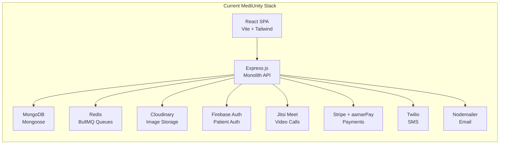
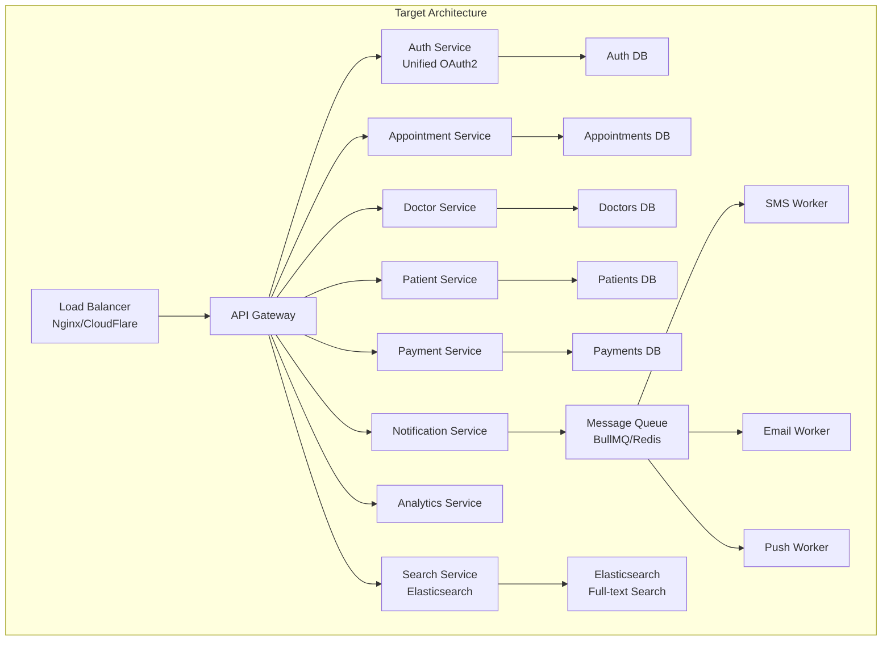
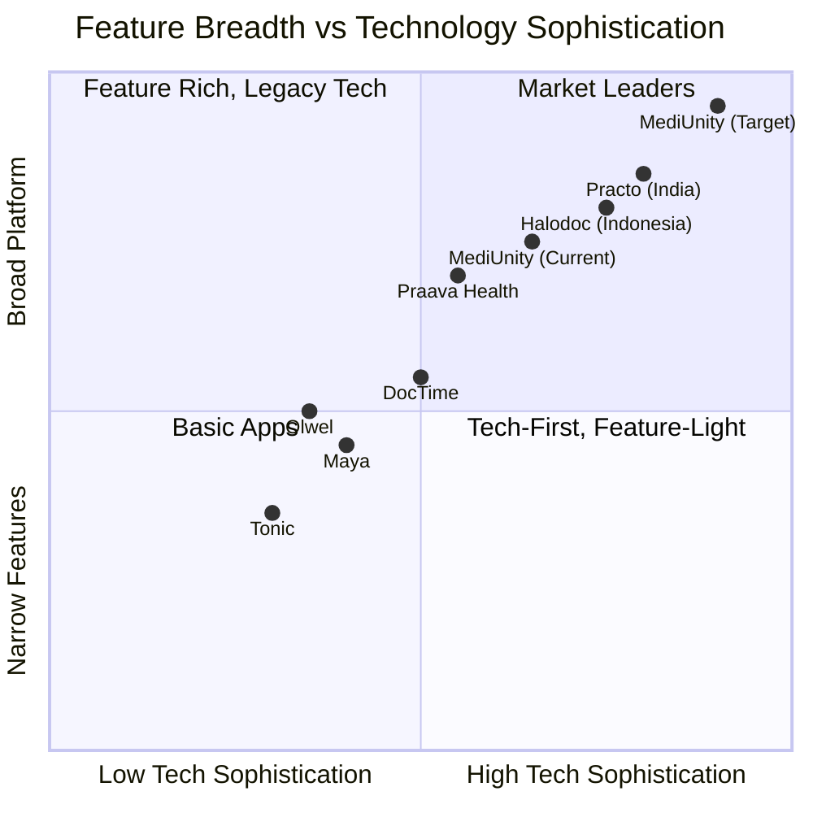

# 🏥 MediUnity vs Bangladesh Medical Apps — Competitive Analysis & Scalability Strategy

## Executive Summary

MediUnity is a **multi-portal healthcare platform** (Patient + Doctor + Partner + Admin) built on React + Node.js + MongoDB. After analyzing it against the top 7 healthcare apps operating in Bangladesh—and benchmarking against global leaders like Practo, Halodoc, and Teladoc—this report identifies **where MediUnity already wins**, **where it falls short**, and **exactly how to leapfrog the competition** at a global scale.

---

## Part 1: The Competitive Landscape

### 🇧🇩 Bangladesh Medical Apps — Feature Matrix

| Feature | **MediUnity** | **Praava Health** | **DocTime** | **Maya** | **Olwel** | **Tonic** | **Sheba.xyz** |
|:---|:---:|:---:|:---:|:---:|:---:|:---:|:---:|
| **Video Consultation** | ✅ Jitsi | ✅ In-app | ✅ 24/7 | ✅ | ✅ | ✅ Chat | ❌ |
| **In-Person Appointments** | ✅ | ✅ Physical centers | ✅ via partners | ❌ | ✅ Home visits | ✅ | ❌ |
| **Symptom Checker** | ✅ + Voice | ❌ | ❌ | ❌ | ❌ | ❌ | ❌ |
| **AI Assistant** | ✅ Gemini AI | ❌ | ❌ | ❌ | ❌ | ❌ | ❌ |
| **Health Tracker** | ✅ + Mood | ❌ | ❌ | ❌ | ❌ | ❌ | ❌ |
| **Recovery Journal** | ✅ | ❌ | ❌ | ❌ | ❌ | ❌ | ❌ |
| **Community Forum** | ✅ | ❌ | ❌ | ✅ Q&A | ❌ | ❌ | ❌ |
| **Pharmacy Orders** | ✅ | ✅ In-house | ✅ E-pharmacy | ✅ | ✅ | ❌ | ❌ |
| **Diagnostic Booking** | ✅ | ✅ ISO-accredited | ✅ Home collect | ✅ | ❌ | ✅ | ❌ |
| **Hospital Services** | ✅ Multi-hospital | ✅ Own centers | ❌ | ❌ | ❌ | ❌ | ❌ |
| **Doctor Verification (BMDC)** | ✅ Auto-scrape + OCR | ✅ Manual | ✅ | ❌ | ❌ | ❌ | ❌ |
| **Multi-Portal (Doctor/Partner)** | ✅ 4 portals | ❌ | ❌ | ❌ | ❌ | ❌ | ❌ |
| **Booking Tracking (No Login)** | ✅ Serial number | ❌ | ❌ | ❌ | ❌ | ❌ | ❌ |
| **Dual Language (BN/EN)** | ✅ | ❌ | ❌ | ✅ | ❌ | ❌ | ❌ |
| **Prescription System** | ✅ Backend | ✅ Full | ✅ Digital | ❌ | ❌ | ❌ | ❌ |
| **Health Articles** | ✅ | ❌ | ✅ Tips | ✅ Large library | ❌ | ❌ | ❌ |
| **Doctor Reputation System** | ✅ Points + Reviews | ✅ NPS | ✅ Reviews | ❌ | ❌ | ❌ | ❌ |
| **Partner Dashboard** | ✅ 3 types | ❌ | ❌ | ❌ | ❌ | ❌ | ❌ |
| **Payment Gateway** | Stripe + aamarPay | Local MFS | bKash/SSLCommerz | ✅ | ✅ | Bundled | ❌ |
| **Ambulance / Emergency** | ❌ | ❌ | ❌ | ❌ | ✅ | ❌ | ❌ |
| **Home Visit** | ❌ | ✅ | ❌ | ❌ | ✅ Core feature | ❌ | ✅ |
| **Wearable/IoT Integration** | ❌ | ❌ | ❌ | ❌ | ❌ | ❌ | ❌ |
| **Family Accounts** | ❌ | ✅ | ✅ Family plans | ❌ | ✅ Parent care | ❌ | ❌ |
| **Chronic Disease Mgmt** | ❌ | ✅ | ❌ | ❌ | ✅ Elderly care | ❌ | ❌ |

---

## Part 2: Where MediUnity Already Wins 🏆

### Unique Advantages Over ALL Bangladesh Competitors

> [!TIP]
> These are your **moat features** — no competitor in Bangladesh has them. Protect and double-down on these.

| # | MediUnity Advantage | Why It Matters |
|---|---|---|
| 1 | **AI-Powered Symptom Checker with Voice Input** | No BD competitor offers this. Praava, DocTime, Maya all lack an AI symptom triage. This is your entry-point differentiator for patients. |
| 2 | **Gemini AI Schedule Manager for Doctors** | Zero competitors give doctors AI-assisted scheduling. This is a massive retention tool for the supply side (doctors). |
| 3 | **4-Portal Architecture (Patient + Doctor + Partner + Admin)** | Every competitor is patient-focused only. MediUnity is a **platform**, not just an app. Hospitals, pharmacies, and diagnostics have their own dashboards. |
| 4 | **Health Tracker + Mood Logging + Recovery Journal** | None of the BD apps offer holistic health tracking. This positions MediUnity as a long-term health companion, not just a doctor-booking tool. |
| 5 | **Automated BMDC Verification (Scraper + OCR)** | Competitors do manual verification. Your automated pipeline (Cheerio scraper + Tesseract OCR + BullMQ worker) is a technical moat. |
| 6 | **Login-Free Booking Tracking** | Patients can track appointments by serial number without creating an account. No competitor offers this low-friction experience. |
| 7 | **Community Forum with Posts** | Only Maya has Q&A. MediUnity's forum model with likes/comments creates a community ecosystem that increases engagement and retention. |
| 8 | **Multi-Hospital/Diagnostic/Pharmacy Partner Network** | MediUnity is the only BD platform where hospitals, diagnostic centers, AND pharmacies all get their own operational dashboards. |

---

## Part 3: Where Competitors Beat MediUnity 🔴

### Critical Gaps That Must Be Closed

| # | Gap | Who Does It Better | Impact if Not Fixed |
|---|---|---|---|
| **G1** | **No bKash/Nagad/Rocket payments** | DocTime (bKash + SSLCommerz), Praava (local MFS) | 💀 **Dealbreaker.** 90%+ of BD digital transactions use MFS. Stripe is irrelevant for average users. |
| **G2** | **No Family Accounts** | Praava (membership plans), DocTime (family subscriptions), Olwel (parent care) | Loses the #1 use case: one family member manages healthcare for everyone. |
| **G3** | **No Emergency/Ambulance Feature** | Olwel (ambulance service + 24/7 doctor) | Missing in a life-or-death moment = permanent user loss. |
| **G4** | **No Home Visit / Home Sample Collection** | Praava (home healthcare), Olwel (core model), DocTime (home collection) | BD patients increasingly expect healthcare to come to them. |
| **G5** | **No Digital Prescription Builder UI** | Praava (full EHR), DocTime (digital Rx) | Backend model exists but doctors can't actually write prescriptions through the platform. |
| **G6** | **No Patient Medical History View for Doctors** | Praava (integrated EHR) | Doctors consult blind — this destroys clinical quality and trust. |
| **G7** | **Incomplete Bangla Localization** | Maya (full Bangla), Tonic (Bangla-first) | Only ~30 strings translated. 98% of BD speaks Bangla. |
| **G8** | **No Appointment Reminders** | DocTime (medicine + follow-up reminders) | Patients forget, no-show rates increase, doctors lose revenue. |
| **G9** | **No EHR / Medical Records System** | Praava (ISO-accredited EHR), DocTime (digital records) | No longitudinal patient record = no care continuity. |
| **G10** | **No Corporate/B2B Health Plans** | Olwel (RMG sector solutions), Tonic (employer packages) | Misses the lucrative corporate wellness market. |

---

## Part 4: Scalability Assessment — Current Architecture vs. What's Needed

### Current Architecture Analysis



### Scalability Scorecard

| Dimension | Current State | Score | What Leaders Do |
|---|---|:---:|---|
| **Architecture** | Monolithic Express.js (722-line index.js) | ⭐⭐ | Microservices with independent scaling |
| **Database** | Single MongoDB instance, no read replicas | ⭐⭐ | Sharded MongoDB + Redis cache layer + read replicas |
| **Caching** | In-memory cache (`cache.js`) | ⭐⭐ | Redis/Memcached with TTL strategies |
| **Queue System** | BullMQ + Redis (great!) | ⭐⭐⭐⭐ | Same — this is already production-grade |
| **Auth** | Dual: Firebase (patients) + JWT (doctors) | ⭐⭐⭐ | Unified OAuth2/OIDC with RBAC |
| **Real-time** | SSE (Server-Sent Events) | ⭐⭐ | WebSocket (Socket.io is in deps but SSE used) |
| **File Storage** | Cloudinary | ⭐⭐⭐⭐ | CDN-backed object storage (same approach) |
| **Security** | Helmet, rate limiting, mongo-sanitize, XSS clean | ⭐⭐⭐ | Same + WAF + end-to-end encryption + HIPAA audit |
| **CI/CD** | Manual (.bat files) | ⭐ | GitHub Actions/GitLab CI + staging + canary deploys |
| **Monitoring** | None visible | ⭐ | APM (Datadog/New Relic), error tracking (Sentry) |
| **Testing** | Minimal | ⭐ | Unit + Integration + E2E tests, >80% coverage |
| **PWA/Offline** | None | ⭐ | Service workers, offline-first data sync |
| **API Design** | REST, inconsistent patterns | ⭐⭐ | REST with OpenAPI spec or GraphQL |

---

## Part 5: Strategic Roadmap to Surpass All Competitors

### 🔴 Phase 1: Close Critical Gaps (Weeks 1-4) — "Table Stakes"

These are features your competitors already have. Without them, MediUnity can't compete.

#### 1.1 — Payment Revolution: bKash + Nagad + SSLCommerz
> **Why**: Stripe is useless for 95% of Bangladeshi users. SSLCommerz covers ALL local banks + MFS in one integration.

```
Implementation:
├── Install SSLCommerz Node.js SDK
├── Create /api/payment/sslcommerz/initiate endpoint
├── Handle IPN (Instant Payment Notification) callback
├── Add bKash direct API for one-tap mobile payments
├── Keep Stripe ONLY for international patients
└── Show local payment methods FIRST in checkout UI
```

#### 1.2 — Family Account System
> **Why**: In most of the world, one person manages healthcare for their entire family. This is your #1 missing user experience.

```
Implementation:
├── Add FamilyMember sub-schema to PatientProfile
│   ├── name, relation, dateOfBirth, bloodGroup
│   ├── medicalHistory[], allergies[]
│   └── separate appointment/prescription history
├── "Switch Profile" dropdown in patient navbar
├── Booking flow: "Who is this appointment for?" selector
└── Each family member gets independent health records
```

#### 1.3 — Digital Prescription Builder (Doctor Portal)
> **Why**: The Prescription model exists but doctors have NO UI to write them. This is your biggest clinical gap.

```
Implementation:
├── Medicine search with autocomplete (BD Drug Index API)
├── Dosage templates (1+0+1, 0+0+1, etc.)
├── Prescription template library for common diagnoses
├── PDF generation with doctor's digital signature (pdfkit already installed!)
├── One-click send to patient + partner pharmacy
└── Auto-add to patient's medical record
```

#### 1.4 — Patient Medical History for Doctors
> **Why**: When a doctor starts a consultation, they need to see the patient's full picture. Flying blind destroys clinical quality.

```
Implementation:
├── PatientSummaryCard component in Doctor Portal
│   ├── Past conditions (from medicalHistory)
│   ├── Active medications
│   ├── Allergies (new field)
│   ├── Recent vitals (from HealthLog)
│   ├── Previous prescriptions (from Prescription model)
│   └── Past consultation notes
├── Show automatically when doctor opens an appointment
└── Consent-based: patient can toggle data sharing
```

---

### 🟡 Phase 2: Differentiation Features (Weeks 5-10) — "Leapfrog"

These features will put MediUnity **ahead** of every competitor.

#### 2.1 — AI-Powered Care Coordination Engine
> **No BD competitor has this.** This is how you become a platform, not just an app.

```
Concept:
├── After symptom checker → AI recommends doctor specialty
├── After consultation → AI suggests diagnostic tests
├── After diagnostic results → auto-notify doctor
├── After prescription → auto-route to nearest pharmacy
├── After treatment → auto-schedule follow-up
└── Complete care loop managed by AI
```

#### 2.2 — Emergency SOS System
```
Features:
├── Red SOS button (floating, always visible)
├── One-tap: Call 999 (national emergency)
├── Auto-detect nearest hospital (use existing GeoJSON data)
├── Show directions via Google Maps
├── Auto-share patient's emergency contacts + blood group
├── Ambulance tracking (partner ambulance services)
└── Emergency medical record card (downloadable offline)
```

#### 2.3 — PWA + Offline-First Architecture
> **Why**: Internet connectivity is unreliable globally, especially in emerging markets. A PWA makes MediUnity accessible even without internet.

```
Implementation:
├── Add service worker with Workbox
├── Cache critical pages: Home, Doctors list, My Appointments
├── Offline symptom checker (pre-load symptom database)
├── Background sync: queue actions offline, execute when online
├── Add to Home Screen prompt
├── Target: <3 second first load on 3G networks
└── Compress all API responses with Brotli
```

#### 2.4 — Chronic Disease Management Programs
> **Olwel does elderly care. Praava does membership plans. MediUnity should do BOTH + more.**

```
Programs:
├── Diabetes Management
│   ├── Daily glucose logging (extend HealthTracker)
│   ├── Medication reminders via SMS
│   ├── Monthly doctor check-in (auto-scheduled)
│   └── Diet plan integration
├── Hypertension Monitoring
│   ├── BP tracking with trend analysis
│   ├── Alert doctor if readings exceed threshold
│   └── Lifestyle recommendation engine
├── Maternal Health
│   ├── Pregnancy week-by-week tracker
│   ├── Prenatal appointment scheduling
│   ├── Emergency hospital routing
│   └── Postpartum care program
└── Mental Health
    ├── Mood tracking (already exists!)
    ├── Therapist matching
    ├── Anonymous support community
    └── Crisis helpline integration
```

---

### 🟢 Phase 3: Scalability Transformation (Months 3-6) — "Enterprise Grade"

#### 3.1 — Microservices Migration



#### 3.2 — Database Scalability Strategy

| Current | Target | Why |
|---|---|---|
| Single MongoDB | MongoDB Atlas (auto-sharding) | Handle 100K+ concurrent users |
| No read replicas | Primary + 2 Read Replicas | Separate read-heavy operations (doctor listings, search) |
| In-memory cache | Redis Cluster (6 nodes) | Session management, API caching, rate limiting at scale |
| No search engine | Elasticsearch | Sub-100ms full-text search across doctors, hospitals, medicines |
| Single-collection queries | Materialized views | Pre-computed dashboards for doctors and partners |

#### 3.3 — CI/CD & DevOps

```
Current (.bat files) → Target:
├── GitHub Actions CI/CD pipeline
│   ├── On PR: lint + unit tests + build check
│   ├── On merge to staging: deploy to staging environment
│   ├── On merge to main: deploy to production with canary
│   └── Automated rollback on error spike
├── Infrastructure as Code (Terraform/Pulumi)
├── Docker containerization for all services
├── Kubernetes for orchestration (or start with Docker Compose)
├── Monitoring: Prometheus + Grafana dashboards
├── Error tracking: Sentry
├── APM: New Relic or Datadog
└── Log aggregation: ELK Stack
```

#### 3.4 — API Standards & Documentation

```
Improvements:
├── OpenAPI 3.0 specification for all endpoints
├── API versioning (/api/v1/, /api/v2/)
├── Standardized error responses
├── Rate limiting per API key (not just IP)
├── GraphQL layer for mobile apps (efficient data fetching)
├── Webhook system for partner integrations
└── SDK generation for third-party developers
```

---

## Part 6: Features That Would Make MediUnity a Global Leader

> [!IMPORTANT]
> These features go beyond what ANY Bangladesh competitor offers and are inspired by global leaders like **Practo** (India, 200M+ users), **Halodoc** (Indonesia, 30M+ users), and **Teladoc** (USA, 90M+ members).

### 6.1 — HL7 FHIR Interoperability
Make MediUnity's patient records exchangeable with any hospital's EHR system worldwide. This is what separates a local app from a healthcare platform.

### 6.2 — Wearable Device Integration
Connect with Apple Watch, Fitbit, Mi Band to auto-populate HealthTracker data. The Health Tracker already exists — just needs data sources.

### 6.3 — AI Clinical Decision Support
Go beyond symptom checking — provide doctors with AI-assisted differential diagnosis during consultations (like what Babylon Health does).

### 6.4 — Multi-Country Expansion Architecture
```
Scalability for global:
├── Multi-tenant architecture (one codebase, country-specific configs)
├── Regulatory compliance per country (HIPAA for US, GDPR for EU, DGHS for BD)
├── Multi-currency support (already have BDT — add USD, INR, IDR)
├── Localization framework (already have BN/EN — add Hindi, Bahasa, Arabic)
├── Country-specific doctor verification APIs
└── Regional payment gateways (bKash for BD, UPI for India, OVO for Indonesia)
```

### 6.5 — Doctor Marketplace & Revenue Model
```
Revenue Streams:
├── Platform fee per appointment (5-15%)
├── Partner subscription plans (Hospital/Pharmacy/Diagnostic)
├── Premium doctor listings (promoted profiles)
├── Health insurance integration (claims processing)
├── Corporate wellness packages (B2B)
├── Diagnostic test commissions
├── Pharmacy delivery margins
└── Advertisement revenue (already have HospitalAd model!)
```

---

## Part 7: Final Competitive Position Map



---

## Summary: Top 10 Actions to Dominate

| Priority | Action | Effort | Impact | Competitive Edge |
|:---:|---|:---:|:---:|---|
| 🥇 | **SSLCommerz/bKash payment integration** | Medium | 🔴 Critical | Matches DocTime, Praava |
| 🥈 | **Prescription Builder UI for doctors** | Medium | 🔴 Critical | Matches Praava, DocTime |
| 🥉 | **Patient medical history for doctors** | Medium | 🔴 Critical | Matches Praava |
| 4 | **Family account system** | High | 🔴 High | Matches Praava, Olwel |
| 5 | **AI Care Coordination Engine** | High | 🔴 High | **Beats ALL competitors** |
| 6 | **Emergency SOS + ambulance** | Medium | 🟡 High | Matches Olwel |
| 7 | **PWA + offline support** | Medium | 🟡 High | **Beats ALL competitors** |
| 8 | **Complete Bangla localization** | Low | 🟡 Medium | Matches Maya |
| 9 | **Microservices migration** | Very High | 🟡 Medium | Enables global scale |
| 10 | **Wearable integration** | High | 🟡 Medium | **Beats ALL competitors** |

> [!CAUTION]
> **The #1 risk is payment integration.** Without bKash/Nagad/SSLCommerz, MediUnity cannot generate revenue in Bangladesh or any market that relies on mobile financial services. This should be your absolute first priority before any other feature work.

---

*Analysis performed: August 3, 2026 | Based on MediUnity codebase analysis + competitive research of 7 Bangladesh healthcare platforms + 3 global leaders*
